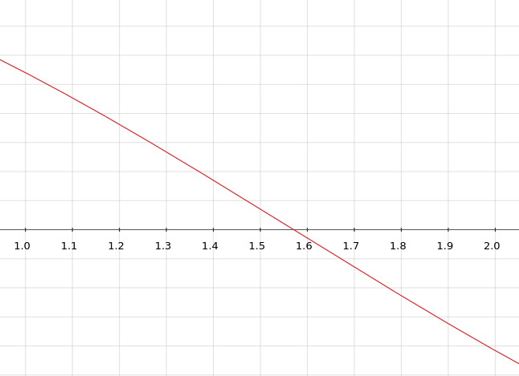

# Metodo Regula falsi

Implementazione del metodo regula flasi per il calcolo degli zeri di una funzione $(f(\alpha) = 0)$

## Idea generale
L'algoritmo di basa sulla ripetuta divisione di un intervallo dato in input, inizialmente si verificano le ipotesi del [teorema di Bolzano](https://it.wikipedia.org/wiki/Teorema_di_Bolzano), se soddisfatte si procederà con la divisione dell'intervallo [a, b] in due semi-intervalli $[a, x^{(k)}]$ e $[x^{(k)} , b]$ dove $x^{(k)}$ è il punto di intersezione con l'asse delle ascisse ottenuto tracciando un segmento che congiunge $f(a)$ e $f(b)$, si andranno nuovamente a valutare le ipotesi del teorema e nell'intervallo dove saranno soddisfatte si procederà nuovamente con la divisione e così via fino a che non si avrà una buona approssimazione del valore.

## Iterata generale

$$ x^{(k)} = \frac{f(b^{(k)})a^{(k)} - f(a^{(k)})b^{(k)}}{f(b^{(k)})-f(a^{(k)})}$$

----

## Esempio 

Sia $f: \mathbb{R} \longrightarrow [-1, 1]$ t.c. $f(x) = cos(x)$,
siano, inoltre 
* $a = 1$
* $b = 2$  
* $tolleranza = 10^{-10}$

Essendo la funzione continua, le ipotesi del teorema di Bolzano sono rispettate e deve esservi una radice compresa tra $[1, 2]$, quindi 
$$x^0 = \frac{\cos(2)-2\cos(1)}{\cos(2)-\cos(1)} \approx 1.56... $$
La funzione, quindi, sarà valutata, $f(1.56) = cos(1.56) \approx 0.0107$, essendo un valore positivo si andrà a considerare l'intervallo $[1.56, 2]$ dato che $f(1.56)*f(2) < 0$, quindi la prissima iterata sarà
$$x^1 = \frac{1.56\cos(2)-2\cos(1.56)}{\cos(2)-\cos(1.56)} \approx 1.57... $$

Oss. L'algoritmo si ferma quando trova un'approssimazione della radice al disotto di una tolleranza (input) oppure quando raggionge il masismo numero di passi stabilito (input).

### Di seguito riportata la tabella delle varie iterate generate con Matlab:

| Passo |    Valore x    | Stima errore  |
|:----: |      :----:    |    :----:     |
| 0     | 1.564904375892 | null          |
| 1     | 1.570978574535 | 6.07e-03      |
| 2     | 1.570796325773 | 1.82e-04      |
| 3     | 1.570796326795 | 1.02e-09      |
